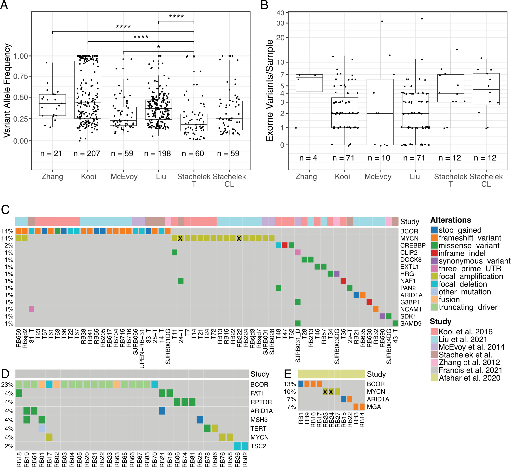
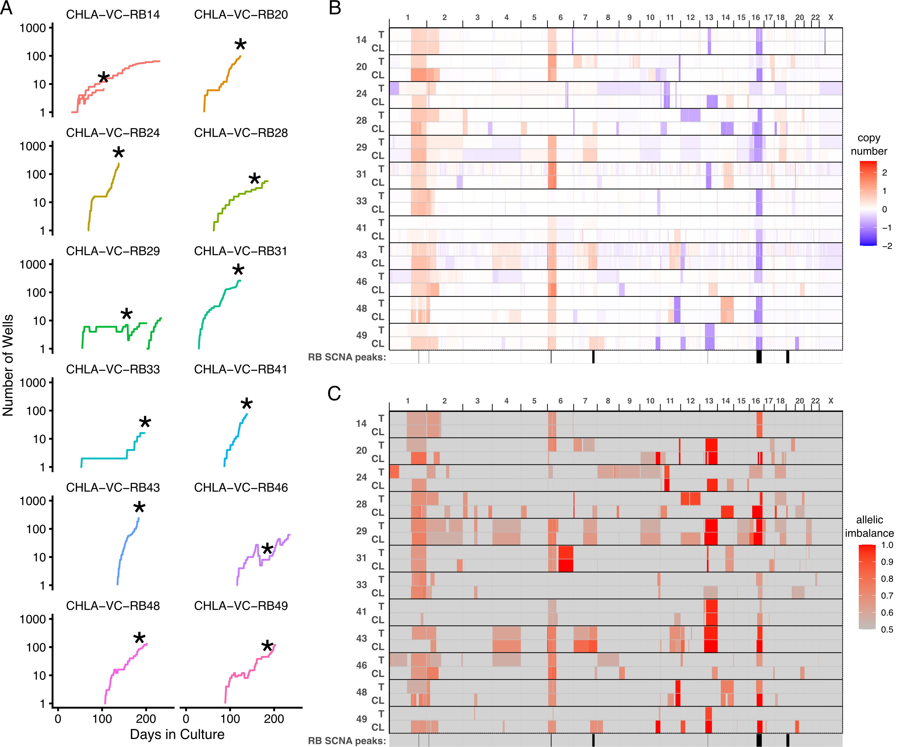
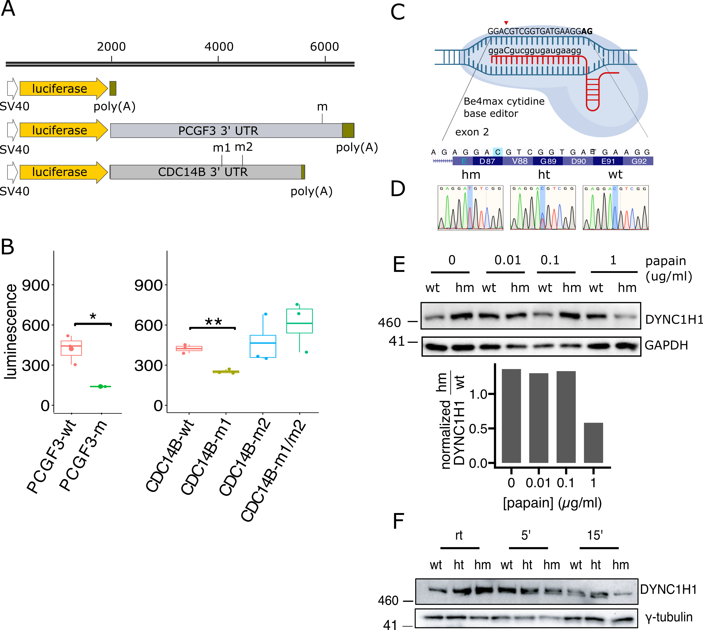

<!-- README.md is generated from README.Rmd. Please edit that file -->

```{r, include = FALSE}
knitr::opts_chunk$set(
  collapse = TRUE,
  comment = "#>"
)
```

# Non-synonymous, synonymous, and non-coding nucleotide  variants contribute to recurrently altered biological processes  during retinoblastoma progression

<!-- badges: start -->
<!-- badges: end -->

Retinoblastomas form in response to biallelic RB1 mutations or MYCN amplification  and progress to more aggressive and therapy-resistant phenotypes through accumulation of secondary genomic changes. Progression-related changes include recurrent  somatic copy number alterations and typically non-recurrent nucleotide variants,  including synonymous and non-coding variants, whose significance has been unclear.  To determine if nucleotide variants recurrently affect specific biological processes,  we identified altered genes and over-represented variant gene ontologies in  168 exome or whole-genome-sequenced retinoblastomas and 12 tumor-matched cell  lines. 



The analyses revealed RB1 mutations, MYCN amplification, and established retinoblastoma somatic copy number alterations. 



We also found enrichment of variant  genes related to diverse biological processes including histone monoubiquitination,  mRNA processing (P) body assembly, and mitotic sister chromatid segregation and  cytokinesis. 


Importantly, non-coding and synonymous variants increased the enrichment significance of each over-represented biological process term. To assess the  effects of such mutations, we examined the consequences of a 30 UTR variant of  PCGF3 (a BCOR-binding component of Polycomb repressive complex I), dual 30 UTR  variants of CDC14B (a regulator of sister chromatid segregation), and a synonymous  variant of DYNC1H1 (a regulator of P-body assembly). One PCGF3 and one of two  CDC14B 30 UTR variants impaired gene expression whereas a base-edited DYNC1H1.




