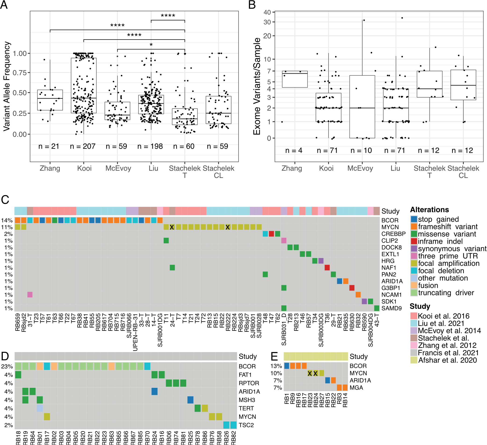
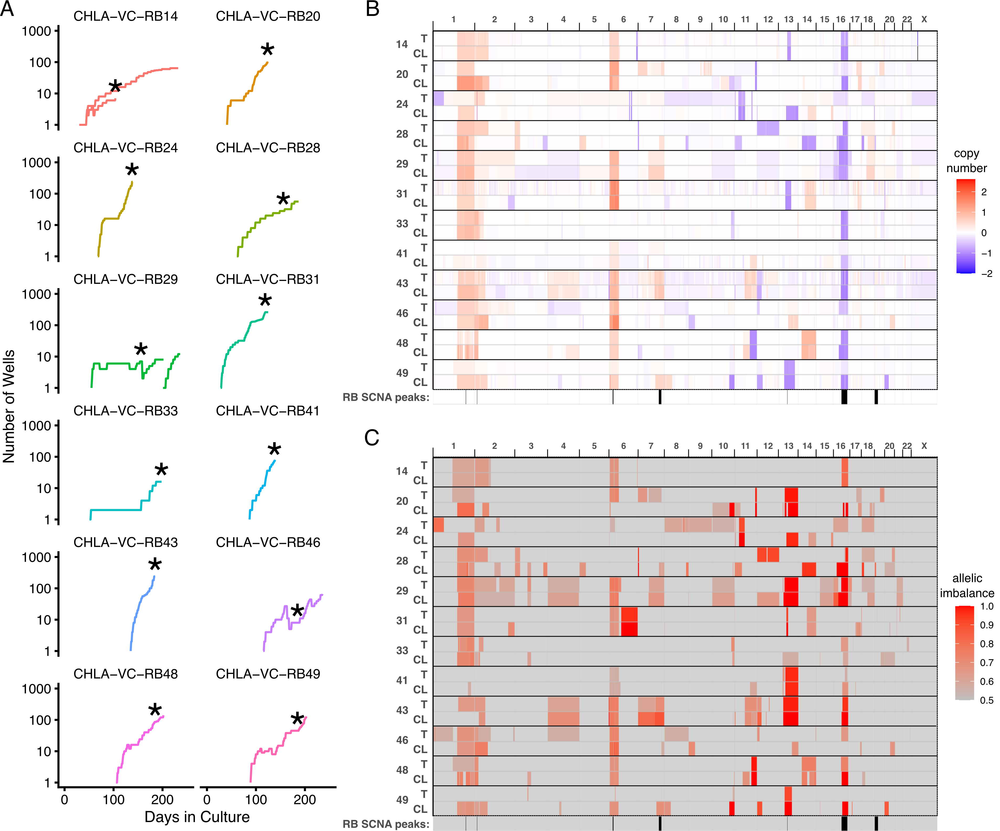
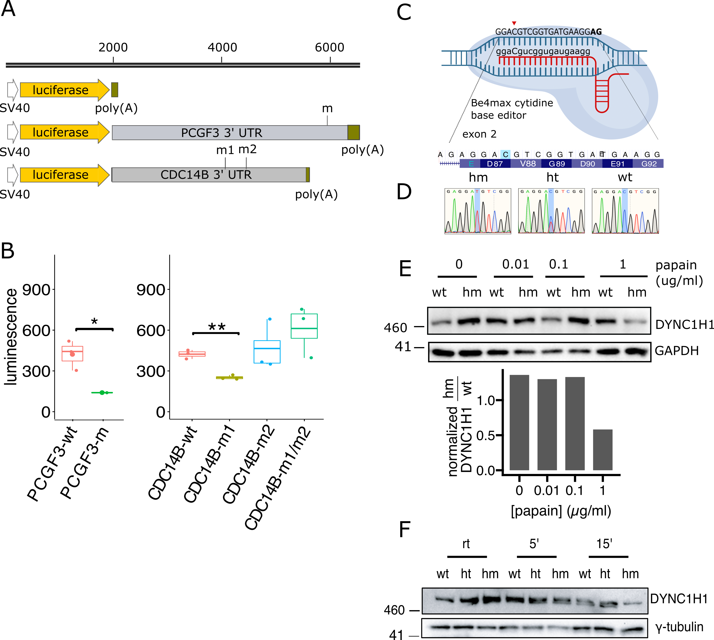

<!-- README.md is generated from README.Rmd. Please edit that file -->

# Non-synonymous, synonymous, and non-coding nucleotide variants contribute to recurrently altered biological processes during retinoblastoma progression

<!-- badges: start -->
<!-- badges: end -->

Retinoblastomas form in response to biallelic RB1 mutations or MYCN
amplification and progress to more aggressive and therapy-resistant
phenotypes through accumulation of secondary genomic changes.
Progression-related changes include recurrent somatic copy number
alterations and typically non-recurrent nucleotide variants, including
synonymous and non-coding variants, whose significance has been unclear.
To determine if nucleotide variants recurrently affect specific
biological processes, we identified altered genes and over-represented
variant gene ontologies in 168 exome or whole-genome-sequenced
retinoblastomas and 12 tumor-matched cell lines.

The analyses revealed RB1 mutations, MYCN amplification, and established
retinoblastoma somatic copy number alterations.

We also found enrichment of variant genes related to diverse biological
processes including histone monoubiquitination, mRNA processing (P) body
assembly, and mitotic sister chromatid segregation and cytokinesis.

Importantly, non-coding and synonymous variants increased the enrichment
significance of each over-represented biological process term. To assess
the effects of such mutations, we examined the consequences of a 30 UTR
variant of PCGF3 (a BCOR-binding component of Polycomb repressive
complex I), dual 30 UTR variants of CDC14B (a regulator of sister
chromatid segregation), and a synonymous variant of DYNC1H1 (a regulator
of P-body assembly). One PCGF3 and one of two CDC14B 30 UTR variants
impaired gene expression whereas a base-edited DYNC1H1.

